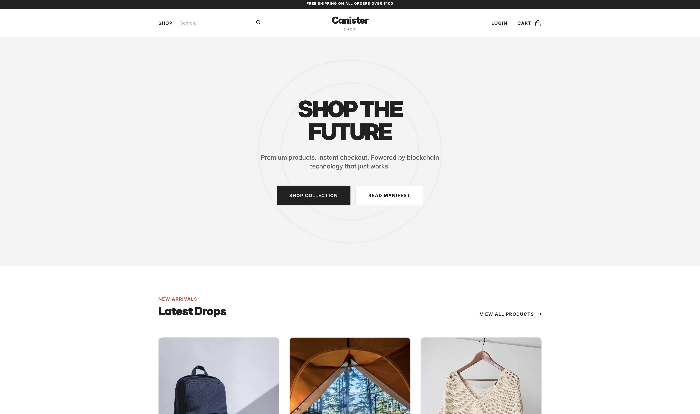
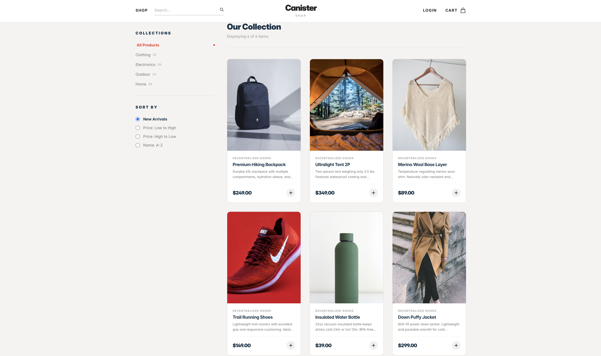
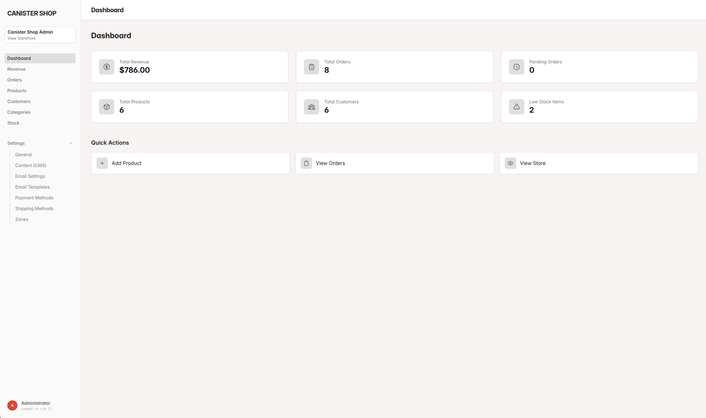
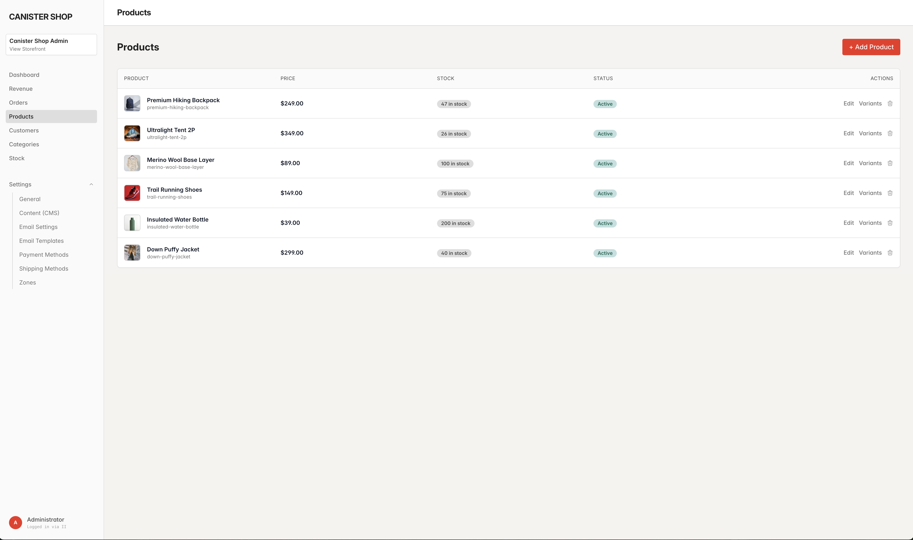

# IC Commerce

A full-featured, decentralized e-commerce platform built on the Internet Computer (ICP). Inspired by Solidus, it provides a complete storefront with admin dashboard, payment processing, and email notifications.

## Screenshots

### Storefront




### Admin Dashboard


### Product Management


## Features

- **Storefront**: Product catalog, cart, checkout, order history
- **Admin Dashboard**: Products, orders, customers, revenue analytics, inventory management
- **Payments**: Stripe Checkout with secure server-side verification
- **Emails**: SendGrid integration for order confirmations and shipping notifications
- **Authentication**: Internet Identity for secure, passwordless login
- **On-chain Database**: SQLite running inside the canister

## Technology Stack

**Frontend**: React, TypeScript, Vite, Tailwind CSS

**Backend**: Rust, ic-sqlite, Candid

**Services**: Stripe (payments), SendGrid (emails), Internet Identity (auth)

## Quick Start

### Prerequisites

- [Node.js](https://nodejs.org/) v22+ (LTS recommended)
- [Rust](https://www.rust-lang.org/tools/install) 1.80+ (via rustup)
- [DFINITY SDK](https://internetcomputer.org/docs/current/developer-docs/setup/install/) (dfx 0.30+)

**Install Rust via rustup** (not Homebrew):
```bash
curl --proto '=https' --tlsv1.2 -sSf https://sh.rustup.rs | sh
```

After installing Rust, add the WebAssembly target and wasi2ic:
```bash
rustup target add wasm32-wasip1
cargo install wasi2ic
```

### Installation

```bash
# Clone the repository
git clone <your-repo-url>
cd ic-commerce

# Install dependencies
npm install

# Start local replica
dfx start --background --clean

# Deploy all canisters (this also generates TypeScript bindings)
dfx deploy
```

### Access the App

After deployment, you'll see URLs like:
- **Storefront**: `http://<frontend-id>.localhost:4943/`
- **Admin Panel**: `http://<frontend-id>.localhost:4943/admin`

## Configuration

The app works out of the box for browsing and testing. Stripe and SendGrid are only needed if you want payment processing and email notifications.

### Stripe Setup (Optional - for payment processing)

1. Create a [Stripe account](https://dashboard.stripe.com/register)
2. Get your API keys from [Stripe Dashboard > Developers > API Keys](https://dashboard.stripe.com/apikeys)
   - **Publishable key**: `pk_test_...` (safe for frontend)
   - **Secret key**: `sk_test_...` (keep secure, never expose)
3. Set up a webhook endpoint:
   - Go to [Developers > Webhooks](https://dashboard.stripe.com/webhooks)
   - Add endpoint: `https://<your-backend-canister>.ic0.app/webhook`
   - Select events: `checkout.session.completed`, `payment_intent.succeeded`
   - Copy the **Signing secret**: `whsec_...`
4. In your Admin Panel, go to **Settings > Payment Methods > Configure Stripe**:
   - Enter your Publishable Key
   - Enter your Secret Key
   - Enter your Webhook Signing Secret
   - Enable the payment method

**Note**: Use test keys (`pk_test_`, `sk_test_`) for development. Switch to live keys for production.

### SendGrid Setup (Optional - for email notifications)

1. Create a [SendGrid account](https://signup.sendgrid.com/)
2. Create an API key at [Settings > API Keys](https://app.sendgrid.com/settings/api_keys)
   - Give it "Full Access" or at minimum "Mail Send" permissions
   - API key format: `SG.xxxxxx...`
3. Verify a sender email at [Settings > Sender Authentication](https://app.sendgrid.com/settings/sender_auth)
4. In your Admin Panel, go to **Settings > Email Settings**:
   - Enter your SendGrid API Key
   - Enter your verified sender email
   - Enable email sending
5. Test with **Settings > Email Templates > Send Test Email**

### Admin Access

The first user to authenticate becomes an Admin. Subsequent users are Customers by default.

To make additional admins, you can update user roles in **Admin > Customers**.

## Project Structure

```
ic-commerce/
├── src/
│   ├── backend/           # Rust backend canister
│   │   ├── src/
│   │   │   ├── lib.rs     # Main canister logic
│   │   │   └── types.rs   # Type definitions
│   │   └── migrations/    # SQLite migrations
│   ├── declarations/      # Generated Candid bindings
│   ├── components/        # React components
│   ├── pages/             # Page components
│   │   └── admin/         # Admin dashboard pages
│   ├── hooks/             # React hooks
│   └── lib/               # Utilities
├── dfx.json               # IC configuration
└── package.json           # Node dependencies
```

## Development

```bash
# Start dev server (frontend only, hot reload)
npm run dev

# Rebuild and deploy backend
dfx deploy backend

# Rebuild and deploy frontend
dfx deploy frontend

# Check Rust code
cargo check --target wasm32-wasip1 -p backend

# Generate Candid declarations
dfx generate
```

## Mainnet Deployment

```bash
# Deploy to mainnet (requires cycles)
dfx deploy --network ic

# Check cycles balance
dfx cycles balance --network ic
```

**Important for mainnet**:
- Switch Stripe to live API keys
- Use a production SendGrid account
- Configure proper CORS and security headers

## Troubleshooting

### "Function not found" errors
Run `dfx generate` to regenerate Candid bindings after backend changes.

### Payment verification failing
Ensure your Stripe webhook secret is correctly configured in Payment Methods settings.

### Emails not sending
1. Verify SendGrid API key has Mail Send permissions
2. Verify sender email is authenticated in SendGrid
3. Check that email settings are enabled in Admin > Settings > Email Settings

## Credits

- **[Solidus](https://github.com/solidusio/solidus)**: This project's data model and admin UX design were inspired by Solidus, an open-source e-commerce platform for Ruby on Rails. The implementation is entirely new, written in Rust for the Internet Computer.
- **[DFINITY](https://internetcomputer.org/)**: Internet Computer platform
- **[ic-sqlite](https://github.com/AmbroseFernandes/ic-sqlite)**: SQLite for IC canisters
